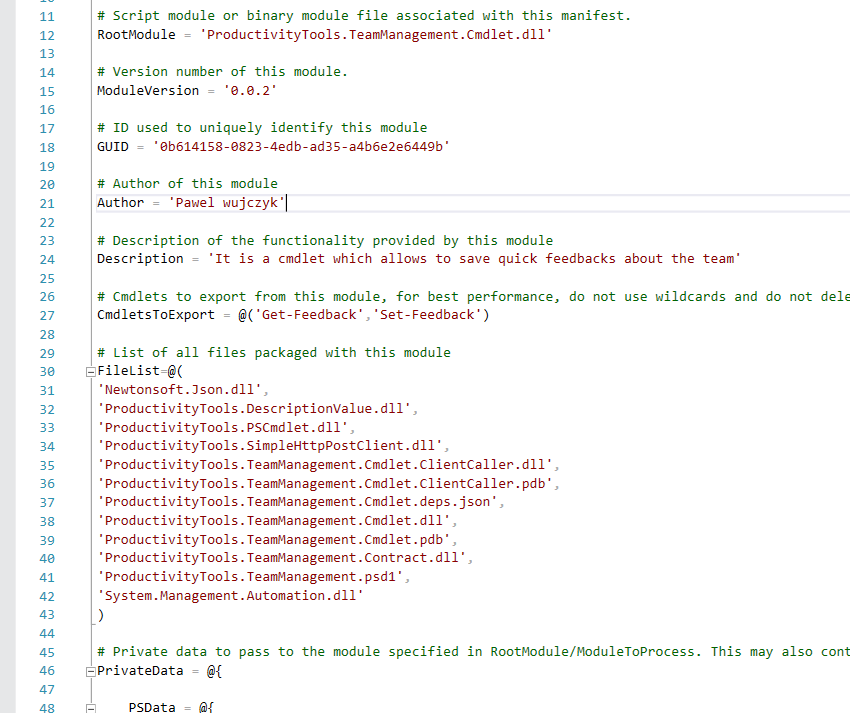
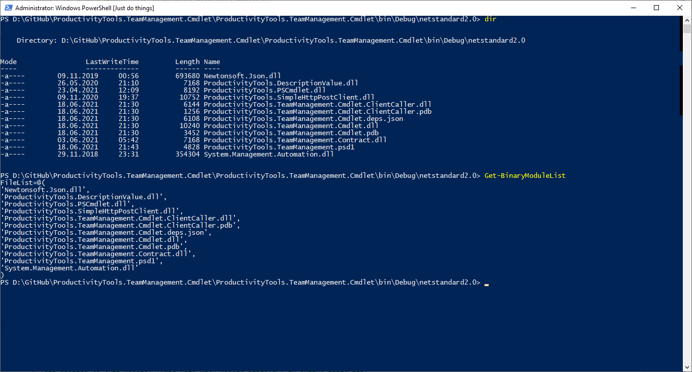

<!--Category:PowerShell--> 
 <p align="right">
    <a href="https://www.powershellgallery.com/packages/ProductivityTools.GetBinaryModuleFileList/"></a>
    <a href="http://productivitytools.tech/get-onedrivedirectory/"><a> 
    <a href="https://github.com/pwujczyk/ProductivityTools.GetBinaryModuleFileList"></a>
</p>
<p align="center">
    <a href="http://http://productivitytools.tech/">
        
    </a>
</p>


# Get binary module FileList

Module prints list of files which can be copied to the psd1 powershell manifest file.

<!--more-->

When creating binary module in the **FileList** section we need to list all files from our **bin** directory. Even for simple modules, list of libraries is too long to make it manually.



### Installation

```powershell
Install-Module ProductivityTools.GetBinaryModuleFileList
```

#### Example

```powershell
 Get-BinaryModuleList
 ```
<!--og-image-->
 

 The code of the module could look a little bit complicated, but it is important not to have comma in after the last element in the FileList.